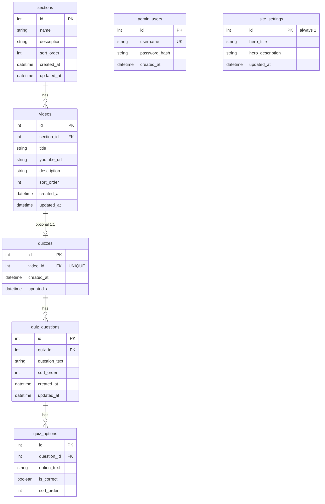

# Biostat Hub — Design Specification

**Date:** 2026-06-30  
**Status:** Approved (pending user spec review)  
**Client:** Bu Rifqatussaadah — Fakultas Kedokteran YARSI

---

## 1. Overview

Biostat Hub is a public learning platform for biostatistics and SPSS data analysis. Users (lecturers, students, researchers) can watch educational videos organized by topic and take optional multiple-choice quizzes — all without login.

A single admin account (the client) manages all content through a separate admin panel. Content is fully dynamic (database-driven), not hardcoded, so the structure can be revised when the client provides the final section/video organization.

### Goals

- Self-paced learning via YouTube-embedded videos grouped by section/topic
- Optional auto-graded quizzes per video (session-only results, no user history)
- Public access without accounts
- Simple admin panel in Bahasa Indonesia for non-IT users

### Non-Goals (v1)

- Public user accounts or registration
- Quiz attempt history per user
- Video file hosting on server
- Multi-user/role admin system
- Drag-and-drop reordering
- "Alur Belajar" section on homepage
- Section `level` badges
- E2E test framework (Cypress/Playwright)

---

## 2. Tech Stack

| Layer | Technology |
|-------|------------|
| Frontend | Next.js 14+ (App Router), Tailwind CSS, TypeScript |
| Backend | Node.js, Express |
| ORM | Prisma |
| Database | SQLite (development); can migrate to MySQL on VPS if needed |
| Auth (admin) | JWT Bearer token |
| Validation | Zod |
| HTTP client | fetch (native) or axios |

### Deployment

- **Frontend:** Vercel or Netlify (static/SSR Next.js)
- **Backend:** VPS (Express API)
- **CORS:** Backend whitelists frontend production domain + `localhost` for development
- **Env:** `NEXT_PUBLIC_API_URL` on frontend; `JWT_SECRET`, `ADMIN_USERNAME`, `ADMIN_PASSWORD`, `CORS_ORIGIN` on backend

---

## 3. Architecture

```
┌──────────────────────────┐       REST/JSON        ┌──────────────────────────┐
│  Frontend — Next.js      │  ──────────────────►   │  Backend — Node.js       │
│  (Vercel / Netlify)      │                        │  Express (VPS)           │
│  Tailwind CSS            │  ◄──────────────────   │  Prisma + SQLite         │
└──────────────────────────┘                        └──────────────────────────┘
   Public: no auth                                    Admin: JWT Bearer token
```

### Monorepo Structure

```
Biostat_Hub/
├── frontend/
│   ├── src/
│   │   ├── app/
│   │   │   ├── page.tsx                    # Beranda
│   │   │   ├── section/[id]/page.tsx
│   │   │   ├── video/[id]/page.tsx
│   │   │   ├── quiz/[videoId]/page.tsx
│   │   │   └── admin/
│   │   │       ├── login/page.tsx
│   │   │       ├── sections/page.tsx
│   │   │       ├── videos/page.tsx
│   │   │       ├── quizzes/page.tsx
│   │   │       └── settings/page.tsx       # Pengaturan Beranda
│   │   ├── components/
│   │   │   ├── layout/                     # SiteHeader, SiteFooter, AdminLayout
│   │   │   ├── ui/                         # Button, Card, Badge, Input, etc.
│   │   │   ├── home/                       # HeroSection, SectionGrid, StatsBar
│   │   │   ├── section/                    # VideoGrid, VideoCard
│   │   │   ├── video/                      # YouTubePlayer
│   │   │   ├── quiz/                       # QuizForm, QuizResult
│   │   │   └── admin/                      # AdminTable, ReorderButtons, QuizEditor
│   │   └── lib/
│   │       └── api.ts                      # API client wrapper
│   ├── tailwind.config.ts
│   └── package.json
│
├── backend/
│   ├── prisma/
│   │   ├── schema.prisma
│   │   └── seed.ts
│   ├── src/
│   │   ├── routes/
│   │   │   ├── public/
│   │   │   └── admin/
│   │   ├── controllers/
│   │   ├── middleware/                     # auth, errorHandler
│   │   ├── validators/                     # Zod schemas
│   │   └── app.js
│   ├── server.js
│   └── package.json
│
├── docs/superpowers/specs/
└── README.md
```

---

## 4. Design Principles

### Visual — "Klinis Modern" (approved mockup)

Follow the client-approved mockup closely. Avoid generic AI/SaaS template aesthetics.

**Color palette (Tailwind custom colors):**

| Token | Hex | Usage |
|-------|-----|-------|
| `navy` | `#0b2e3d` | Primary, header |
| `teal` | `#0f6e6e` | Accent |
| `mint` | `#1fb6a6` | Highlight, CTA |
| `bg-light` | `#f7faf9` | Page background |
| `teal-soft` | `#e3f3f1` | Card background |

**Do:**
- Clean system sans-serif typography with clear hierarchy
- Cards: border-radius 10–14px, thin soft borders, minimal shadow
- Teal-navy gradients only for hero and category badges (subtle)
- lucide-react icons where needed
- Realistic placeholder content (actual biostatistics/SPSS topic names)
- Direct, practical Bahasa Indonesia copy

**Don't:**
- Colorful/purple startup gradients
- Generic marketing headlines
- Bento grids, glassmorphism, excessive animations
- Cartoon illustrations, emoji as icons
- Over-spaced "SaaS template" layouts
- Decorative elements without purpose

### Code

- No over-abstraction (no repository pattern for simple CRUD)
- No unnecessary utility files or state management libraries
- Descriptive component names tied to domain (not `FeatureCard`, `HeroWrapper`)
- Admin labels in plain Bahasa Indonesia — no technical jargon (CRUD, field, payload, endpoint)

### Content Flexibility

All mutable content lives in the database and is editable via admin. When the client provides the final section/video structure, changes require no code deployment — only admin panel updates.

---

## 5. Database Schema



### Business Rules

- `quizzes.video_id` is UNIQUE — one quiz per video maximum
- `is_correct` on `quiz_options` is never sent to public clients before quiz submission
- Delete section: rejected (HTTP 409) if section contains any videos
- Delete video: cascades delete of associated quiz, questions, and options
- `youtube_url` stored as full URL; backend extracts `videoId` for embed
- `site_settings` has exactly one row (id = 1), seeded on first run
- Hero stats (video count, section count) are computed dynamically from database

---

## 6. API Endpoints

**Base URL:** `/api`

### Public (no auth)

| Method | Endpoint | Description |
|--------|----------|-------------|
| `GET` | `/settings` | Hero title + description |
| `GET` | `/sections` | All sections ordered by `sort_order`, includes `_count.videos` and aggregate stats |
| `GET` | `/sections/:id` | Section detail + videos list |
| `GET` | `/videos/:id` | Video detail + section info + `has_quiz` flag |
| `GET` | `/videos/:id/quiz` | Quiz questions + options (no `is_correct`) |
| `POST` | `/videos/:id/quiz/submit` | Submit answers → score + per-question results |

**`GET /sections` response includes:**
```json
{
  "sections": [...],
  "stats": { "total_videos": 12, "total_sections": 4 }
}
```

**`POST /videos/:id/quiz/submit` request:**
```json
{
  "answers": [
    { "question_id": 1, "option_id": 3 },
    { "question_id": 2, "option_id": 7 }
  ]
}
```

**Submit response:**
```json
{
  "score": 2,
  "total": 3,
  "results": [
    { "question_id": 1, "selected_option_id": 3, "correct_option_id": 3, "is_correct": true },
    { "question_id": 2, "selected_option_id": 7, "correct_option_id": 5, "is_correct": false }
  ]
}
```

### Admin (JWT required)

| Method | Endpoint | Description |
|--------|----------|-------------|
| `POST` | `/admin/login` | Returns `{ token, expires_in }` |
| `GET` | `/admin/settings` | Get site settings |
| `PUT` | `/admin/settings` | Update hero title + description |
| `GET` | `/admin/sections` | List sections |
| `POST` | `/admin/sections` | Create section |
| `PUT` | `/admin/sections/:id` | Update section |
| `DELETE` | `/admin/sections/:id` | Delete (fails if videos exist) |
| `PATCH` | `/admin/sections/:id/reorder` | `{ direction: "up" \| "down" }` |
| `GET` | `/admin/videos` | List all videos |
| `POST` | `/admin/videos` | Create video |
| `PUT` | `/admin/videos/:id` | Update video |
| `DELETE` | `/admin/videos/:id` | Delete video + associated quiz |
| `PATCH` | `/admin/videos/:id/reorder` | Reorder within section |
| `GET` | `/admin/videos/:id/quiz` | Get full quiz (includes `is_correct`) |
| `PUT` | `/admin/videos/:id/quiz` | Save entire quiz (replace all questions/options) |
| `DELETE` | `/admin/videos/:id/quiz` | Delete quiz for video |

### Auth Flow

1. Admin submits username + password to `POST /admin/login`
2. Backend validates against `admin_users`, returns JWT
3. Frontend stores token in `localStorage`
4. All admin requests include `Authorization: Bearer <token>`
5. Logout: clear token from `localStorage` (server-side invalidation optional)

---

## 7. Pages & UI

### Public Pages

#### `/` — Beranda
- Hero: title + description from `site_settings`, dynamic stats (section count, video count)
- Section grid: clickable cards → `/section/[id]`
  - Card shows: name, description, video count
- No "Alur Belajar" section

#### `/section/[id]` — Daftar Video
- Breadcrumb: `Beranda › [Nama Section]`
- Section title + description
- Video card grid: title, truncated description, "Ada Kuis" badge if applicable
- Click card → `/video/[id]`

#### `/video/[id]` — Pemutar Video
- Responsive YouTube embed (16:9)
- Title, section name (link back), optional description
- "Kerjakan Kuis" button — only if quiz exists

#### `/quiz/[videoId]` — Kuis
- Title: "Kuis: [Judul Video]"
- All questions + radio options on one page
- "Kirim Jawaban" button at bottom
- After submit: score display + per-question correct/incorrect with correct answer highlighted
- "Kembali ke Video" link

### Admin Pages

Simple sidebar layout (desktop) / top menu (mobile). Four menu items:

1. **Kelola Materi** — `/admin/sections`
2. **Kelola Video** — `/admin/videos`
3. **Kelola Kuis** — `/admin/quizzes`
4. **Pengaturan Beranda** — `/admin/settings`

#### `/admin/login`
- Fields: Nama Pengguna, Kata Sandi
- Error: "Nama pengguna atau kata sandi salah"

#### `/admin/sections` — Kelola Materi
- List: name, video count, ↑↓ reorder, Edit, Hapus
- Form: Nama Materi, Deskripsi
- Delete blocked with message: "Materi ini masih berisi X video. Hapus atau pindahkan video terlebih dahulu."
- Delete confirm: "Yakin hapus materi ini?"
- "Lihat di Website" link opens public section page in new tab

#### `/admin/videos` — Kelola Video
- Filter dropdown by materi
- Form: Judul Video, Link YouTube, Pilih Materi (dropdown), Deskripsi (optional)
- YouTube validation error: "Link YouTube tidak dikenali. Pastikan Anda menyalin link dari YouTube."
- ↑↓ reorder within same section
- Delete confirm: "Video dan kuis terkait (jika ada) akan ikut dihapus."

#### `/admin/quizzes` — Kelola Kuis
- Select video dropdown (grouped by materi)
- Single-page dynamic form editor
- Per question: pertanyaan (textarea), 4 pilihan jawaban (input), radio for jawaban benar
- "+ Tambah Soal" / "Hapus Soal Ini" buttons
- Single "Simpan Kuis" saves everything
- "Hapus Kuis" if quiz exists

#### `/admin/settings` — Pengaturan Beranda
- Form: Judul Beranda, Deskripsi Beranda
- "Simpan Perubahan" button
- Success: "Pengaturan beranda berhasil disimpan."

### UI Copy Reference

| Context | Text |
|---------|------|
| Save success | "Perubahan berhasil disimpan." |
| Delete success | "Berhasil dihapus." |
| Server error | "Terjadi kesalahan. Silakan coba lagi." |
| Quiz incomplete | "Mohon jawab semua soal sebelum mengirim." |
| Common buttons | "Simpan", "Batal", "Hapus", "Tambah Baru" |
| 404 page | "Halaman tidak ditemukan" + link to Beranda |

---

## 8. Seed Data (Placeholder)

Four example sections with 2–3 videos each; 1–2 videos have short quizzes.

| Section | Example Videos |
|---------|---------------|
| Uji Normalitas | Shapiro-Wilk di SPSS, Q-Q Plot |
| Uji Hipotesis | Uji-t satu sampel, Uji-t dua sampel independen |
| Analisis Korelasi | Korelasi Pearson, Korelasi Spearman |
| Regresi Linear | Regresi sederhana, Interpretasi output SPSS |

**Default site settings:**
- hero_title: "Biostat Hub"
- hero_description: Short description about self-paced biostatistics learning at YARSI

**Admin account:** seeded from environment variables (`ADMIN_USERNAME`, `ADMIN_PASSWORD`).

---

## 9. Error Handling

### Backend
- Centralized error middleware → `{ "error": "pesan Bahasa Indonesia" }`
- Validation errors → HTTP 422
- Auth failure → 401; forbidden → 403
- Section delete with videos → 409
- Not found → 404

### Frontend
- Inline form errors (red, concise)
- Simple loading state ("Memuat...")
- Custom 404 page
- Client-side quiz validation before submit

---

## 10. Testing

| Area | Approach |
|------|----------|
| API | Manual testing with seed data + Thunder Client/Postman |
| Quiz grading | Unit test for scoring logic |
| Auth | Test valid/invalid login, protected routes without token |
| Frontend | Manual QA in browser (desktop + mobile) |

No E2E framework in v1.

---

## 11. Implementation Order

1. Monorepo setup + Prisma schema + seed
2. Backend API (public endpoints → admin CRUD → auth)
3. Public frontend (beranda → section → video → quiz)
4. Admin frontend (login → CRUD pages → settings)
5. Visual polish per mockup + responsive QA

---

## 12. Decisions Log

| Topic | Decision |
|-------|----------|
| Section fields | name, description, sort_order only (no `level`) |
| Section navigation | Separate page `/section/[id]` |
| Homepage | Hero + section grid only |
| UI language | Full Bahasa Indonesia |
| Quiz layout | All questions on one page, single submit |
| Section delete | Blocked if videos exist |
| Content reorder | Up/down buttons (not drag-and-drop) |
| Hero text | Editable via admin (`site_settings`) |
| Backend | Node.js + Express (not Laravel) |
| Frontend | Next.js + Tailwind (not Vite SPA) |
| Deployment | Frontend on Vercel/Netlify, backend on VPS |
| ORM | Prisma + SQLite |
| Admin auth | JWT Bearer token |
| Quiz question images | v2 — external link only (no server upload) |

---

## 13. v2 Backlog: Gambar di Soal Kuis

**Status:** Diimplementasi (link eksternal, opsional per soal).

**Keputusan:** Klien lebih nyaman pakai **link gambar eksternal** (Google Drive dll.) — tidak ada upload file ke server. Sama pola mental dengan video YouTube: file di hosting luar, website hanya simpan URL.

### Perilaku yang direncanakan

- Field opsional `image_url` di tabel `quiz_questions`
- Admin → Kelola Kuis → per soal ada input **"Link Gambar (opsional)"**
- Label bantuan: *"Upload gambar ke Google Drive, buat link publik, lalu tempel di sini."*
- Halaman kuis publik: jika `image_url` ada, tampilkan gambar di atas teks soal (responsive, max-width)
- Validasi backend: URL format valid; tidak perlu host whitelist ketat di v2

### Yang tidak masuk scope v2

- Upload file dari admin panel
- Image hosting di VPS / S3 / Cloudinary
- Editor rich-text di soal

### Estimasi implementasi

~半 hari: migrasi DB + update API quiz + form admin + tampilan di `QuizForm`
